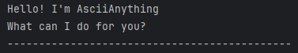

# AsciiAnything User Guide



AsciiAnything is a cli tool for keeping track of and saving a list of your tasks.

## Adding tasks

Add a todo: `todo <description>`

Add a deadline: `deadline <description> /by <due date>`

Add a event: `event <description> /from <start time> /to <end time>`

## Listing tasks

Listing all your tasks: `list`

expected output:
```commandline
Here is your list of tasks:
1: [T][ ] this thing
2: [T][ ] that thing
3: [D][ ] another thing (by: this time)
4: [E][ ] one more thing (from: now to: later)
```

## Deleting tasks

Delete a certain task: `delete <index>`

## Marking tasks as done

Mark a task as done: `mark <index>`

## Finding a specific task using a key word

Search by keyword: `find <keyword>`

```commandline
The tasks with that description is/are:
3: [D][ ] another thing (by: this time)
```
## Exiting

Exiting the program: `exit`